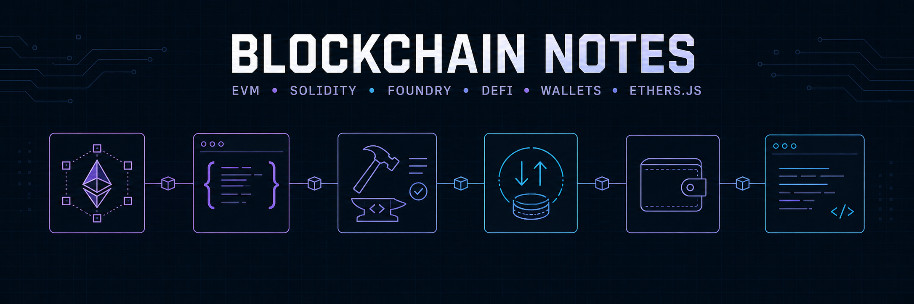

# Blockchain Notes

A growing collection of the notes, explanations, and practical lessons I gathered while learning Ethereum development. The chapters follow my path from understanding how Ethereum works to writing, testing, securing, and interacting with smart contracts.

## What I learned

| Chapter | Topics covered |
| --- | --- |
| [1 — EVM and Ethereum](./1%20-%20EVM%20and%20Etherium.docx) | Accounts, transactions, blocks, proof of stake, EVM execution, gas, events, and logs. |
| [2 — Solidity](./2%20-%20Solidity.docx) | Contract structure, inheritance, interfaces, libraries, ETH transfers, errors, modifiers, and oracles. |
| [3 — Foundry](./3%20-%20Foundry.docx) | Building, deploying, scripting, and interacting with contracts, plus unit, fuzz, and invariant testing. |
| [4 — DeFi and Smart Contract Security](./4%20-%20DeFi%20and%20Smart%20Contract%20Security.docx) | ERC-20 tokens, access control, staking, reentrancy defenses, AMMs, liquidity pools, and Uniswap mechanics. |
| [5 — Wallet Engineering](./5%20-%20Wallet%20Engineering.docx) | ECDSA signature recovery, EIP-712 typed data, domain separation, hashing, and ABI encoding. |
| [6 — TypeScript and ethers.js](./6%20-%20TypeScript%20and%20Ethers.js.docx) | TypeScript and asynchronous JavaScript fundamentals, providers, wallets, signers, contract calls, ABIs, and calldata. |

## Using the notes

The documents are numbered in the order I studied them. Read them sequentially for the full learning path, or open an individual chapter as a quick refresher on a specific topic.

> These are personal learning notes, not production guidance. Always verify security-sensitive patterns against current documentation and audited implementations.
